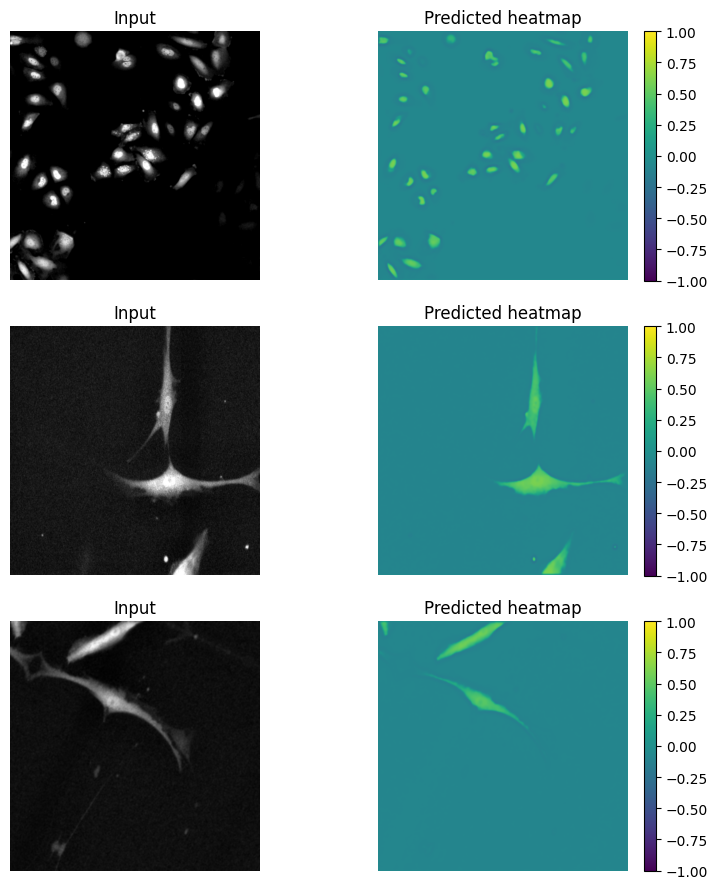
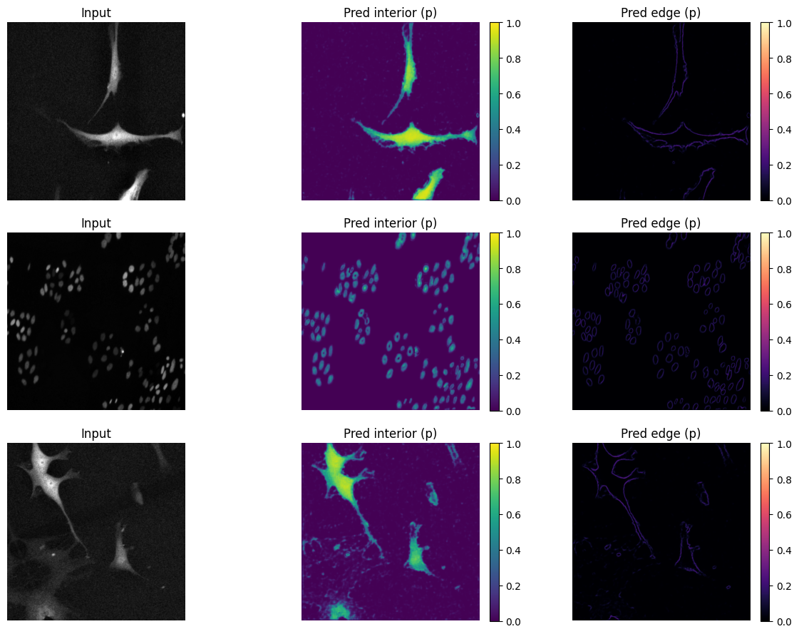
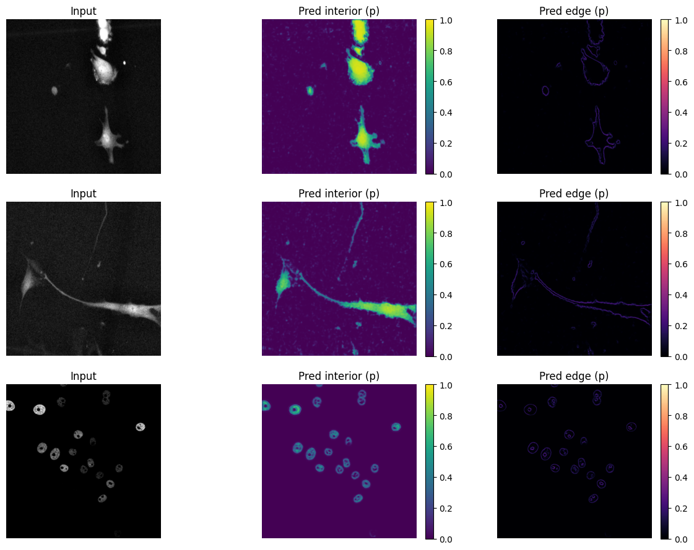
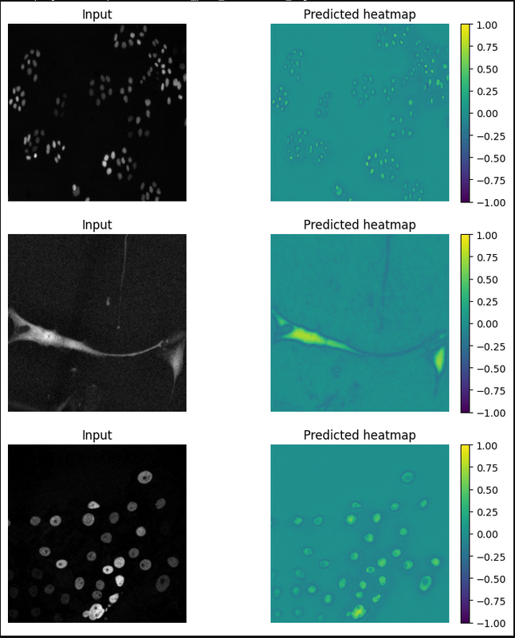
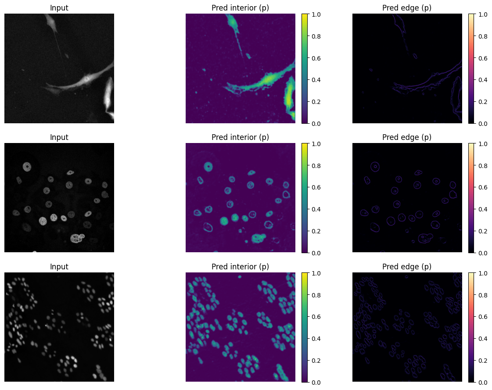
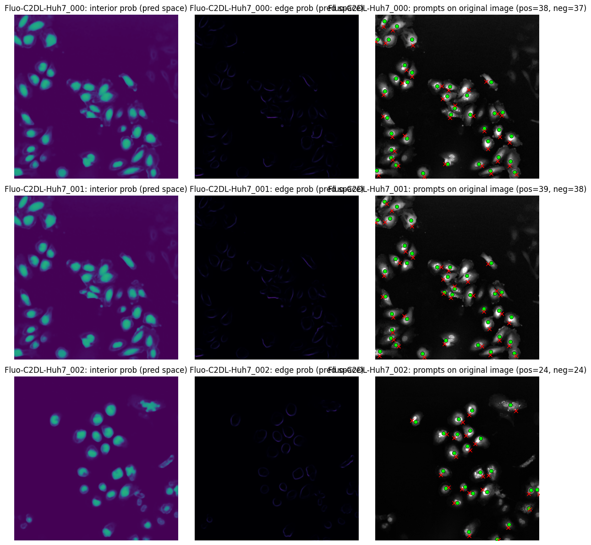

# Cell Tracking Challenge CV Project

End-to-end classical + deep learning pipeline for fluorescence microscopy cell instance segmentation prompt generation, SAM-based mask extraction, and SEG-style evaluation.

## Project Goals

- Train a CNN that predicts two channels from grayscale microscopy images:
	- interior probability
	- boundary/edge probability
- Convert CNN predictions into prompt points for SAM.
- Run prompt-based SAM segmentation and optional edge-guided post-cutting.
- Evaluate instance quality using a SEG-style IoU matching metric.

## Repository Layout

```text
.
├── ComputerVisionProject.ipynb: Our original stage 1 work
├── requirements.txt
├── checkpoints/
│   └── heatmapcnn/
├── data/
│   ├── imgs_contrast/
│   ├── masks/
│   └── train_predictions/
├── images/
│   ├── appendix1.png
│   ├── appendix2.png
│   ├── appendix3.png
│   ├── appendix4.png
│   ├── appendix5.png
│   ├── appendix6.png
│   └── appendix7.png
└── src/
		├── data-preparation/
		└── prompt-generation/
				├── cnn.ipynb
				└── resnet18.ipynb
```

## Environment Setup

1. Create and activate a virtual environment.
2. Install dependencies:

```bash
pip install -r requirements.txt
```

3. Open the notebooks in VS Code/Jupyter and select the project venv kernel.

## Pipeline Overview

### 1) CNN Training

- Model: custom convolutional network (`HeatmapCNN`) for 2-channel dense prediction.
- Input: grayscale cell image.
- Output:
	- channel 0: interior logits/probability
	- channel 1: edge logits/probability
- Loss: weighted BCE + small total variation regularizer.

### 2) Prediction Export

- Run trained model on the training split.
- Save:
	- interior prediction maps
	- edge prediction maps
	- masks used for downstream processing

### 3) Prompt Generation

- Prompt candidates generated from CNN outputs.
- Includes bump/local-maxima strategy, NMS, and filtering to reduce redundancy.
- Prompts are written to CSV (including original-image coordinates).

### 4) SAM Inference

- Use CNN-generated prompts as positive point prompts for SAM.
- Create raw instance maps.
- Optional edge-guided cut/postprocess to split ambiguous merged regions.

### 5) Evaluation

- SEG-like score based on object-level IoU matching.
- For each GT object, best overlapping predicted instance IoU is used.
- IoU below threshold (default 0.5) contributes 0.

## Main Artifacts

- Model checkpoints: `checkpoints/heatmapcnn/`
- Prompt CSVs: `data/train_predictions/prompts/`
- SAM outputs:
	- `data/sam_prompt_outputs/raw_instances/`
	- `data/sam_prompt_outputs/cut_instances/`
	- `data/sam_prompt_outputs/viz/`

## How To Run (Notebook Flow)

Use `src/prompt-generation/cnn.ipynb` as the primary executable pipeline:

1. Data setup and dataset construction.
2. Train / load heatmap CNN.
3. Export prediction maps.
4. Generate prompt CSV.
5. Run SAM with CNN prompts.
6. Evaluate SEG on the training set.

## Figures









